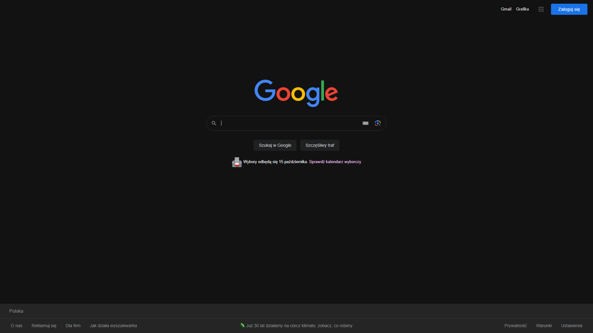

# Surfer
Surfer is a web browser, written in Python. It uses PyQT5 WebEngine to display websites, and the keyboard module to recognize hotkeys.
The core philosophy of this browser is _Keyboard-driven Minimalism._ This browser also has a customizable website blocking list.  

  

## Arguments
This browser should be launched from the terminal. When launching the browser, the user can specify arguments. The list of acceptable arguments can be found below.
| Argument        | Short Name | Function                                                                              |
| --------------- |:----------:| -------------------------------------------------------------------------------------:|
| --url URL       | -u         | Launches the specified URL in the browser.                                            |
| --query QUERY   | -q         | Searches for the specified query on the specified search engine [default: duckduckgo] |
| --dark_mode     | -dm        | Forces Dark Mode on all websites.                                                     |                                                                                                                                                        
